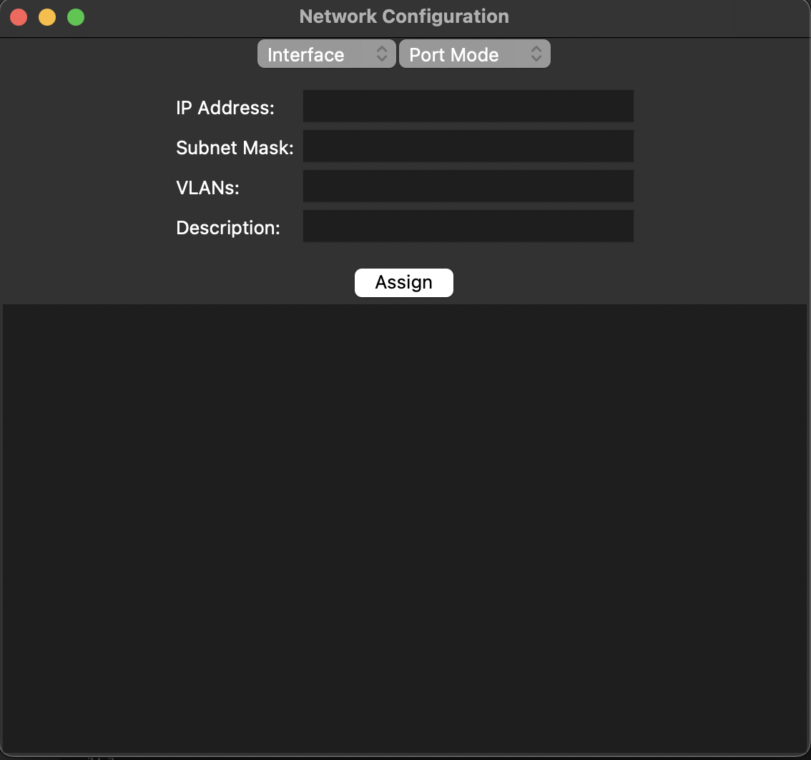
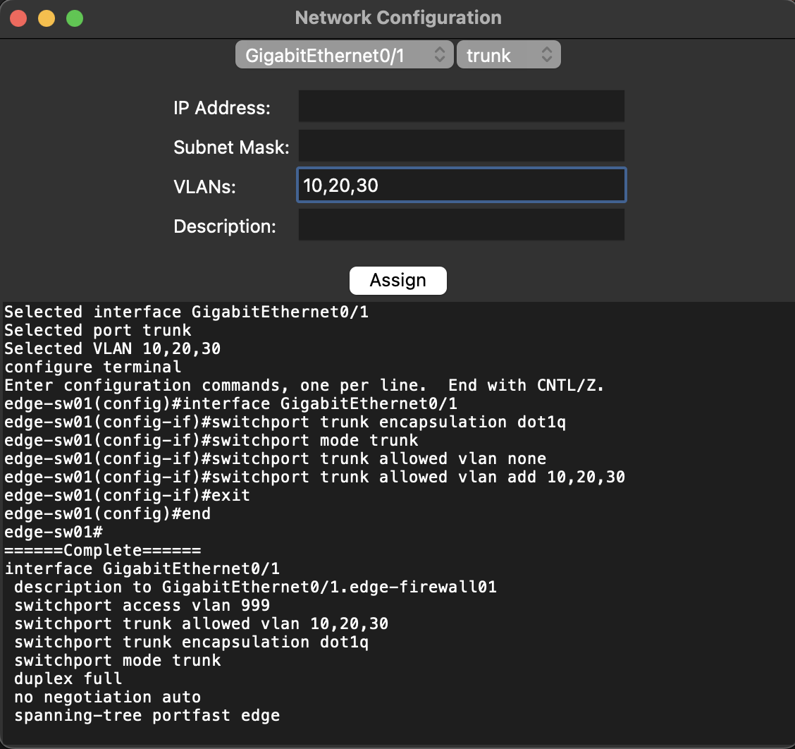

# Cisco Switch Configuration Tool
Elian Manzueta
June 5, 2022

I created a Cisco switch configuration tool in Python using the modules Tkiner and Netmiko. This script supports both L2 and L3 switch configuration, allowing the user to specify their desired VLANs, port modes, and IP addresses. This script works with Layer 3 Cisco switches running Cisco IOS. For my testing environment, I used edge-sw01 in the Cisco Modeling Labs sandbox.

## GUI 

## GUI in Action

The GUI will tell you what you've inputted for your selections, and then output the Cisco IOS CLI configuration plus a verification by showing the interface show run. 

### Sources

https://realpython.com/python-gui-tkinter/

https://pyneng.readthedocs.io/en/latest/
