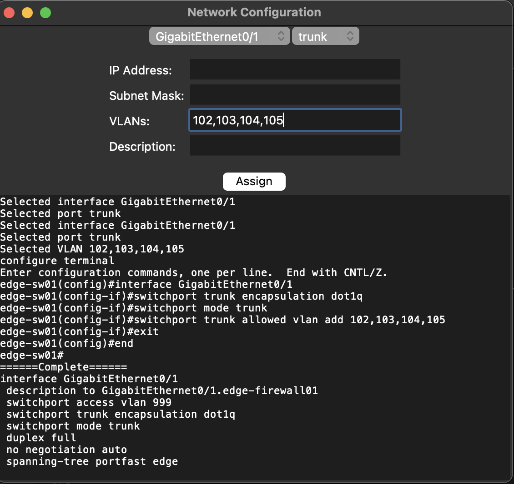

# py_network_config
Elian Manzueta
June 5, 2022

I'm working on creating a network configuration tool written in Python with the modules Tkinter and Netmiko.  As of right now, I've implemented VLAN creation, port mode selection, and interface configuration with more features to come! 

## GUI 

## GUI in Action

The GUI will tell you what you've inputted for your selections, and then output the Cisco IOS CLI configuration. 

### Sources

https://realpython.com/python-gui-tkinter/

https://pyneng.readthedocs.io/en/latest/
